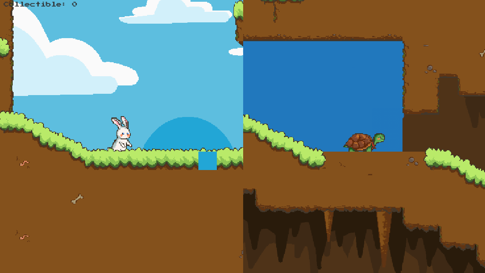

# ChimuWaku
This is our Software Engineering Project repositories.

ChimuWaku is a video game with the platformer genre. This game is designed to be played by 2 people in local multiplayer because it consists of two characters, namely Chimu and Waku. The word ChimuWaku comes from Japanese which means 'cooperation'. As the name suggests, this game emphasizes cooperation between two players to solve puzzles and overcome the obstacles contained in each level. To add an interesting impression and advance the local games industry, we are highlighting the Indonesian children's story, namely 'The Rabbit and the Turtle' and developing the value of mutual cooperation in the game.

Goals:
- Encouraging the growth of the local gaming industry by creating unique, interesting, high-quality, and educational video games so that people in Indonesia and abroad are interested in playing them. 
- Creating games with an Indonesian cultural background to embed the nation's cultural values in the players through the stories and characters featured in the game. 
- Providing a local multiplayer feature that allows a player to play together with others. This can help reduce stress and loneliness, thereby improving the players' mental health.

## Documentation
### Controls
#### Chimu
A - Move Left
D - Move Right
Space_Bar - Jump

#### Waku
Left Arrow Key - Move Left
Right Arrow Key - Move Right
Up Arrow Key - Jump

### Start Menu

### Game Display



## Setup
- Run ```git clone https://github.com/Alvin-Winst/ChimuWaku.git``` in your cmd
- Open Unity Hub, Click on Add
- Navigate into the folder you cloned this repository

This project is made with Unity Editor Version 2022.3.20f1

## Collaborator
<p align='center'>
  <b>Follow us here 🌿</b><br> 
  <a href="https://github.com/Alvin-Winst">Alvin Ray Winston</a> |
  <a href="https://github.com/Ren9x">Darren Leonard</a> |
  <a href="https://github.com/sethyrical">Teresa Anjori</a> |<br>
  <a href="https://github.com/aufamsp">Aufa Muhammad Sulthan Pasha</a> |
  <a href="https://github.com/FebyAgatha">Feby Agatha Christie Kurniawan</a><br><br>

  Don't forget to leave a star if you find this repository helpful ⭐⭐⭐⭐⭐
</p>
